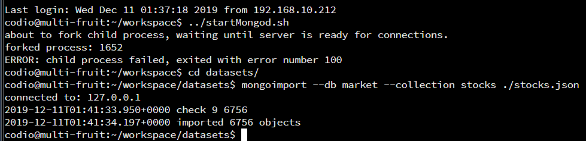
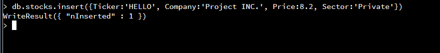
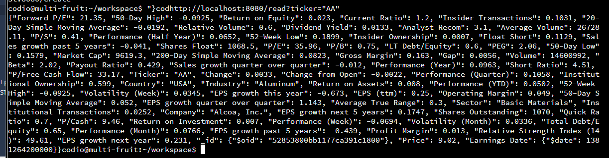

# Databases

### [Home](https://ihza430.github.io)  | [Code Review](/code_review.html) | [Software Engineering & Design](/software_design.html) | [Data Structures & Algorithms](/data_structures.html) | [Databases](/databases.html)

---
- [Narrative](#an)
- [Enhancement Text](#en)
- [Code](#co)

## Narrative
For this enhancement on databases, I have chosen to do the artifact from CS 340: Advanced Programming Concepts. This artifact was created on December 15, 2019. The original project was to create a RESTful API and a user documentation. The code which is python in conjunction with MongoDB consisted of ways to delete, insert, update, retrieve certain data, and utilize a RESTful API. The user documentation was showing internal stakeholders the advantage of using a document-oriented database and how to use it. 
The reason I choose this item for this category because it directly worked with databases. Most common databases are relational. I thought that using a different kind of database management like document-oriented would show my skill and broader knowledge of databases. The artifact specifically the user documentation which includes parts of the code, really exemplifies my ability to manage databases in terms of deleting, creating, updating, and retrieving information from a database. This also showed my ability to use a client/server connection through the RESTful API and use of curl commands. The artifact was enhanced by including data mining. I felt like data mining would show my ability of extracting useful information from databases. Managing a database is just one aspect of databases. The importance of databases is the information gained from it. 

The course outcomes that closely aligns to this enhancement are “demonstrate an ability to use well-founded and innovative techniques, skill, and tools, in computing practices for the purpose of implementing computer solutions that deliver value and accomplish industry-specific goals” and “design, develop, and deliver professional-quality oral, written, and visual communications that are coherent, technically sounds and appropriately adapted to specific audiences and contexts.” The reason why this enhancement aligns with the first outcome stated because MongoDB is being used which is skill to give insight to the internal stakeholders. A report will be made to inform these stakeholders and that requires professional-quality written and visual communications that is specific to the audience. 

Looking at the process of enhancing at this artifact, I did have some trouble. To successfully data mining, I had to create new aggregate statements to be able to get the information I needed. Aggregating was not my strong suit but as I was doing it more and more, I learned how to do it properly and really understand what each part of the statement means. The major challenge is determining what information I needed. I do not know much about stocks or investing. For this artifact, quite a bit of research was needed to understand what would be beneficial to stakeholders in terms of looking at stocks. 

## Enhancement Text

---
- [Collection Management](#cm)
- [Document Manipulation](#dm)
- [Document Retrieval](#dr)
- [Advanced Programming](#ap)
- [Data Mining](#da)

### I. Collection Management

Collection management is an integral part of keeping the database. Internal stakeholders need access to the collection of data at a moment notice. MongoDB stores data that provides high performance and availability among different platforms. A collection is a group of documents. For stakeholders, this would be the information on stocks that can include company names and valuable information about the stock’s performance. If there are already available data, it can be easily imported into Mongo. There is copious amount of data available and for a system to search throughout all the time can lower the performance. To solve this, a user can create single or compound indexes to alleviate this. The following examples are on importing files into databases and creating indexes. 

A. Starting and Importing in Mongo

../startMongod.sh -> Starts mongo within the terminal

cd datasets/ -> Changes the directory to datasets for importing

mongoimport –db market –collection stocks ./stocks.json -> Imports the documents from the file stocks.json to the database (db) market within the collection stocks. 

B. Index

1. 

db.stocks -> distinguishes what database a collection to use

ensureIndex ->commands to create index (Note: can use createIndex)

({“Company”:1}) -> specifies the key/field to include in the index. 1 is for ascending order. If -1 that is for descending order.
	This creates an index with all the company names from the collection stocks. Stakeholders will be able to retrieve the names of 	the companies that have stocks faster. 
  
2. 

({“Company”:1, “Price”:1, “P/E”:1, …}) -> specifies the keys/fields to be included in the index. Each key/field are separated		 by a comma. 
This is like the first index, but more fields are added which makes it a Compound index. The keys/fields included are Company, Price, P/E, Beta, and Dividend. The company name is important to know who to invest in. Price, P/E, Beta, and Dividend are great indicators to determine whether to invest in the company’s stocks or not (Parker, 2019). 

3.  

getIndexes() -> gets all the indexes and information on them
This is to ensure that the following indexes that were made were created properly. 	

### II. Document Manipulation

Document manipulation is essential as it is the heart of managing the data. It allows to insert, update and delete documents from the collection. Examples are shown below with two options. One is using a prepared file and another is directly on the terminal. 

A. Insert

To run the text file, python was used followed by the location of the text file within the directory. The result is a number which corresponds to the unique ID number given when inserting the document.

insert -> commands to insert following data

({Ticker:’HELLO’, Company:’Project INC.’…}) -> key/value pairs to be inserted. Each pair is separated by a comma.

find -> used to find documents within the specified database and collection.

({“Ticker”:”TEST”}) -> to determine which document to find. In this case the key/field (Ticker) that matches “TEST” of the inserted document. 

pretty() -> organizes the result in an easy to view manner. 

To test that the document was properly inserted, the document with the name of the inserted document was found.

B. Update

Similar to Insert above, use python followed by the location of the text file. 

Update -> commands to update document

{“Ticker”:”HELLO”}, -> specifies which document to update

{‘$set’:{“Volume”:700}}) -> sets which key/value pair to update to. For instance, if volume was originally 100, this will change it to 700.

The document that matches the ticker, TEST was found. It can be seen that the volume has been added as a key/value pair which makes this a successful update. 

C. Delete
 
 

Similar to those above, use python followed by the location of the text file. 

Remove -> command to remove document

({“Ticker”:”HELLO”}) -> specifies what document to remove 

When trying to find the document with the Ticker value of TEST, there was no results which is to be expected since the document has been deleter. 

### III. Document Retrieval

Document retrieval is important to any stakeholders as it allows for users to view the information needed to make decisions when working with stocks. Stakeholders need to know the name of the company or what industry a company is a part of. In this section, examples on how to retireve these critical information are shown in two ways. The first is through a text file and the second is directly in the terminal. 

A. Retrieve Documents

i. 50-Day Simple Moving Average 

Similar process, use python followed by the location of the text file. 

({“50-Day Simple Moving Average”: -> specifies which key to look at for matching

{“$gt”:0.01, “$lt”:0.06}}) -> these are the values for the key to match. $gt means greater than. $lt means less than. In simple terms, this statement reads a 50-Day Simple Moving Average between the ranges od 0.01-0.06.

Count() -> counts the number of documents that match this criteria

The function was to count the number of documents that have a 50-Day Simple Moving Average within the range. The range for this specific case was between 0.01 and 0.06. The result was 2,086. Finding certain documents within a range for a specific key/value pair is important to stakeholders if they are trying to find specific stocks within them. For instance, if an internal stakeholder was looking at the risk in investing in a stock, they would look at the key Beta. The range of anything less than one is a low risk stock. This would easily determine how many stocks are low risk. 

ii. Industry
 
 
 

Similar process, use python followed by the location of the file

({“Industry”:”Medical Laboratories & Research”}, -> specifies which documents to find

{“Ticker”:1}) ->specifies which key and value pair to view. (0 would specifiy which key/value pair not to view)

This statement finds all the documents that are within the industry of medical laboratories and research. It will print out the ticker value of all documents that match. This allows for stake holders to easily find the Ticker value for a specific industry or sector that they might be looking at. The key/value pari can be changed to suit the needs of the stakeholder

B. Aggregation

Similar to previous ones, use python followed by the location of the file

Aggregate -> uses to specify that we will be aggregating

({“$match”:{“Sector”:”Healthcare”}}, -> finds documents that match the key/value pair which is the key, Sector having a value of Healthcare.

{“$group”:{_id:”$Industry”, totalShares:{$sum:”$Share Outstanding}}}) -> specifies that the matching documents will be grouped based on the Industry. For example, all the documents in the healthcare sector that are within the biotechnology industry will be grouped together. The share outstanding key will be summed up from all the documents within that grouping. So for instance if there are three documents within that grouping and have share outstanding of the 3, 4, and 5, the total share will be 12. 

### IV. Advanced Programming

A.	Restful API

Restful API allows clients to interact with the database through curl commands. Because of the reusability of the code, clients can enter their own queries when using the curl commands. 
B.	CRUD Functionality

a.	Create

 
b.	Read

 
c.	Update

 
d.	Delete
 

C.	Advanced Querying

i.	Stock Summary Information
 

 

ii. Five Top Stocks

 

### V. Data Mining

For the purpose of this data mining example, the stocks of multiple companies within the database will be looked at. The internal stakeholders would most likely want to know which companies to invest in the future. A rule of thumb is buy stocks that are low and sell stocks that are high. Using the database, we can determine which stocks have the lowest prices and highest prices in each industry. The reason, an internal stakeholder would want to focus on one particular industry is so that they have expertise in that industry and keep up with trends within the industry. Below are examples of the top 5 highest priced stocks and top 10 lowest priced stock within the Biotechnology industry. The highest priced stock at 275.39 is from the company Regeneron Pharmaceuticals. If a stakeholder had already invested in that stock it would be ideal for them to sell those stocks. 

In terms of buying stocks, Alseres Pharmaceuticals, Inc or Nile Therapeutics, Inc are priced at 0.04 and 0.05 respectively. It would be in the interest of the stakeholder to buy these stocks. 

Now these prices are only good to a stakeholder if they know the trajectory of the company. For instance Regeneron could still raise the prices of their stocks so it would be in the best interest of the stakeholder to hold on to that stock and wait for the peak time to sell them. Another example is Alseres can be low but if the company trajectory remains the same, the stakeholder gains no profit from it. The results below are companies with the lowest projected growth in the next 5 years. Alseres Pharmaceuticals is projected to have no growth in the next 5 years. It would be a waste of money and effort for a stakeholder to invest in the company. 

 
The results below are the highest projected growth in the next 5 years. The company Regeneron Pharmaceuticals has a projected growth of 0.32. If the stakeholder has this stock it would be advised that they keep the stock a while longer to ensure they get the best possible price for selling. 

 
Data mining is all about gathering information and determining what it means. If the data in the databases were just looked at it would mean nothing. Once the data is analyzed, patterns and relationships can be seen. For instance a relatioship between price and projected growth can help a stakeholder decided whether they want to invest in a particular stock. 

References

Parker, T. (2019, June 25). 5 Essentials You Need To Know About Every Stock You Buy. Retrieved from https://www.investopedia.com/financial-edge/0411/5-essential-things-you-need-to-know-about-every-stock-you-buy.aspx.

## Code
